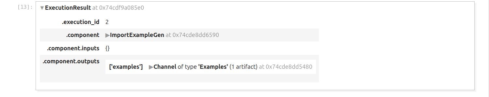

# 📰 News Authentication Pipeline

<p align="center">


</p>

---

# 📚 Table of Contents

- Introduction
- Features
- Project Architecture
- Complete Pipeline Overview
- Pipeline Components
- Model Architecture
- TensorFlow Serving
- Making Predictions
- TensorBoard
- Prometheus Monitoring
- Pipeline Orchestration
    - Apache Beam
    - Apache Airflow
    - Kubeflow Pipelines
- Streamlit User Interface
- Continuous Feedback Loop
- Project Structure
- Installation
- Running the Project
- Future Improvements
- License

---

# 📖 Introduction

The **News Authentication Pipeline** is an **end-to-end Machine Learning MLOps project** developed using **TensorFlow Extended (TFX)** that automates every stage of the machine learning lifecycle—from data ingestion to model deployment and continuous feedback collection.

Unlike a conventional machine learning project, this repository demonstrates how a production-grade ML system can be built by combining:

- TensorFlow Extended (TFX)
- TensorFlow Serving
- Apache Beam
- Apache Airflow
- Kubeflow Pipelines
- Streamlit
- Prometheus
- TensorBoard

The pipeline has been designed with production deployment in mind and includes several **custom TFX components** to extend the capabilities of the standard TFX ecosystem.

These custom components enable:

- Custom feature engineering
- Schema modification
- Data cleaning
- Human approval before deployment

The trained model is deployed using **TensorFlow Serving**, allowing predictions through both **REST APIs** and **gRPC APIs**.

To continuously improve the model after deployment, a **user feedback mechanism** has been incorporated into the Streamlit application, enabling new labeled data to be collected for future training cycles.

---

# ✨ Features

- End-to-End Machine Learning Pipeline
- Built using TensorFlow Extended (TFX)
- Custom Feature Engineering Component
- Custom Schema Updater
- Custom Data Cleaning Component
- Custom Human Evaluation Component
- Automatic Feature Transformation
- Training-Serving Skew Prevention
- TensorFlow Serving Deployment
- REST API Prediction
- gRPC Prediction
- TensorBoard Integration
- Prometheus Monitoring
- Apache Beam Orchestration
- Apache Airflow Orchestration
- Kubeflow Pipeline Support
- Streamlit User Interface
- Continuous User Feedback Collection
- Continuous Model Improvement

---

# 🔄 End-to-End Pipeline Workflow

The complete pipeline follows the sequence shown below:

```
TFRecord Dataset
        │
        ▼
Data Ingestion
        │
        ▼
Feature Engineering
        │
        ▼
Statistics Generation
        │
        ▼
Schema Generation
        │
        ▼
Schema Updater
        │
        ▼
Example Validator
        │
        ▼
Data Cleaner
        │
        ▼
Data Transformer
        │
        ▼
Model Trainer
        │
        ▼
Model Resolver
        │
        ▼
Model Evaluator
        │
        ▼
Human Evaluator
        │
        ▼
Model Pusher
        │
        ▼
TensorFlow Serving
        │
        ▼
REST / gRPC APIs
        │
        ▼
Streamlit UI
        │
        ▼
User Feedback Collection
        │
        ▼
Future Model Retraining
```

This workflow represents the complete lifecycle of a production-grade machine learning system, beginning with raw data ingestion and ending with continuous learning from user feedback.

---

# ⚙ Pipeline Components

## 1. Data Ingestion

The Data Ingestion component is responsible for reading the dataset stored in **TFRecord** format and converting it into examples suitable for downstream TFX components.

The component performs:

- Reading TFRecord files
- Splitting dataset into:
  - Training
  - Validation
  - Testing
- Creating Examples artifact

This serves as the entry point of the complete machine learning pipeline.

### Component Screenshot





---

## 2. Feature Engineering (Custom Component)

Feature Engineering is a **custom TFX component** developed specifically for this project.

Instead of directly using the raw news article, the component extracts handcrafted numerical features that help the neural network better understand writing quality and linguistic characteristics.

The engineered features include:

| Feature |
|---------|
| num_single_quote_error |
| num_spacing_error |
| num_space_absence_after_sentence_completion |
| num_capitalized_words |
| num_capitalization_absence_after_sentence_completion |
| num_spelling_errors |
| num_punctuations |
| num_numeric_values |
| num_words |

These handcrafted features are later combined with textual embeddings inside the neural network.

### Component Screenshot

<p align="center">


</p>

---

## 3. Statistics Generator

The Statistics Generator analyzes the generated dataset and computes descriptive statistics for every feature.

The generated statistics include:

- Mean
- Median
- Standard Deviation
- Minimum
- Maximum
- Missing Values
- Feature Distribution
- Histograms
- Quantiles
- Feature Frequency

These statistics help developers understand the characteristics of the dataset before training.

### Component Screenshot

<p align="center">


</p>

---

## 4. Schema Generator

The Schema Generator automatically infers the schema of the dataset from the computed statistics.

The generated schema includes:

- Feature Names
- Data Types
- Domains
- Value Constraints
- Shape Information
- Presence Constraints

The generated schema is later used for anomaly detection.

### Component Screenshot

<p align="center">


</p>

---

## 5. Schema Updater (Custom Component)

Although TFX automatically generates the schema, production systems often require manual modifications.

To support this, a **custom Schema Updater component** was developed.

This component allows developers to modify various schema properties such as:

- Minimum Presence Fraction
- Feature Constraints
- Domains
- Feature Validation Rules
- Additional Metadata

This provides complete flexibility while keeping the remaining pipeline automated.

### Component Screenshot

<p align="center">


</p>


## 6. Example Validator

The **Example Validator** is responsible for validating the generated examples against the schema.

Using the schema produced by the **Schema Generator** (and optionally modified by the **Schema Updater**), this component identifies anomalies within the dataset before model training begins.

The Example Validator can detect issues such as:

- Missing features
- Unexpected feature types
- Invalid feature values
- Data drift
- Schema drift
- Distribution anomalies between different dataset splits

By identifying anomalies early in the pipeline, invalid data is prevented from propagating into downstream components, thereby improving the reliability of the trained model.

### Component Screenshot

<p align="center">


</p>

---

## 7. Data Cleaner (Custom Component)

The **Data Cleaner** is another custom TFX component developed specifically for this project.

Real-world datasets often contain noisy or incomplete data that can negatively affect model performance. This component performs data cleaning operations before feature transformation and model training.

The Data Cleaner supports operations such as:

- Removing null values
- Imputing missing values
- Removing insignificant features
- Cleaning invalid records
- Preparing a cleaner dataset for downstream components

This ensures that the training pipeline operates on high-quality data.

### Component Screenshot

<p align="center">


</p>

---

## 8. Data Transformer

The **Data Transformer** is one of the most important components in the entire pipeline.

It transforms both the handcrafted numerical features and the raw text into a format suitable for the neural network.

### Numerical Feature Transformation

For numerical features, the transformer performs:

- Feature Scaling
- Normalization
- Standardization (where required)

### Text Feature Transformation

The raw news article undergoes several preprocessing steps:

- Remove extra spaces
- Remove stop words
- Remove unwanted symbols
- Remove punctuations
- Remove digits
- Convert text to lowercase
- Text cleaning
- Tokenization
- Sequence Padding

### Transform Graph

In addition to transforming the training data, the component also generates a **Transform Graph**.

This transform graph is exported along with the trained model and automatically applies identical preprocessing during inference.

As a result, the pipeline completely eliminates **training-serving skew**, ensuring that the same preprocessing logic is applied during both training and prediction.

### Component Screenshot

<p align="center">


</p>

---

## 9. Model Trainer

The **Model Trainer** trains the News Authentication neural network using the transformed dataset generated by the previous components.

Unlike a simple text classification model, this architecture combines both handcrafted numerical features and learned textual representations.

The model consists of two parallel neural networks:

- Numerical Feature Processing Network
- Text Processing Network

The outputs of these two subnetworks are concatenated before passing through the final classification layers.

This hybrid architecture enables the model to leverage both linguistic patterns and engineered statistical features.

### Component Screenshot

<p align="center">


</p>

---

# 🧠 Model Architecture

The News Authentication model is composed of two major branches:

```
                 Input Features
                      │
          ┌───────────┴───────────┐
          │                       │
          ▼                       ▼
 Numerical Features          Text Feature
          │                       │
          ▼                       ▼
 Dense Network        Text Processing Network
          │                       │
          └───────────┬───────────┘
                      ▼
              Feature Concatenation
                      │
                      ▼
              Fully Connected Layers
                      │
                      ▼
            Fake / Authentic Prediction
```

---

## Numerical Feature Processing Network

The numerical branch processes the handcrafted features extracted during the Feature Engineering stage.

The extracted features include:

- Number of spelling errors
- Number of punctuation marks
- Number of words
- Number of numeric values
- Capitalization-related features
- Spacing-related features

These features are passed through a Dense Neural Network that learns higher-level feature representations before combining them with textual embeddings.

### Architecture Screenshot

<p align="center">


</p>

---

## Text Processing Network

The textual branch processes the entire news article.

Rather than using a conventional single LSTM, the architecture consists of multiple custom layers designed specifically for this project.

The network contains:

- Basic Text Processing Layer
- Input Divider Layer
- Multi-LSTM Layer

Together, these components enable the model to capture information at multiple sequence lengths.

### Architecture Screenshot

<p align="center">


</p>

---

### Basic Text Processing Layer

The Basic Text Processing Layer is responsible for learning textual representations from a sequence of tokens.

Internally, it consists of:

- Embedding Layer
- LSTM Layer
- Dense Layers

This layer extracts semantic information from textual inputs before passing the learned representations to downstream layers.

### Screenshot

<p align="center">


</p>

---

### Input Divider Layer

Different portions of a news article often contain different levels of information.

The Input Divider Layer divides the input sequence into multiple smaller sequences of different lengths.

Each generated sequence is independently processed by separate LSTM networks.

This enables the model to learn information from multiple receptive fields instead of relying on a single fixed-length sequence.

### Screenshot

<p align="center">


</p>

---

### Multi-LSTM Layer

The Multi-LSTM Layer receives the multiple sequences produced by the Input Divider Layer.

Each sequence is processed by an independent Basic Text Processing Layer.

The outputs from all LSTM branches are then combined to create a richer representation of the news article.

This architecture allows the model to capture both local and long-range dependencies within the text.

### Screenshot

<p align="center">


</p>

---

### Complete Model Architecture

The complete neural network combines both handcrafted numerical features and learned textual representations.

This hybrid architecture improves the model's ability to identify fake news by utilizing both statistical writing characteristics and semantic information contained within the article.

### Architecture Diagram

<p align="center">


</p>

---

## 10. Model Resolver

The **Model Resolver** identifies the latest blessed (best-performing) production model.

Instead of comparing the newly trained model against arbitrary thresholds, the pipeline compares it with the most recently approved production model.

This enables continuous improvement while ensuring that only superior models are promoted for deployment.

### Component Screenshot

<p align="center">


</p>

---

## 11. Model Evaluator

The **Model Evaluator** assesses the performance of the newly trained model using the testing dataset.

Evaluation metrics include:

- Accuracy
- Precision
- Recall
- Area Under Curve (AUC)
- Binary Cross Entropy
- Additional TensorFlow Model Analysis metrics

The component also compares the current model with the latest blessed model obtained from the Model Resolver.

Only if the newly trained model outperforms the existing production model is it considered for deployment.

### Component Screenshot

<p align="center">


</p>

---

## 12. Human Evaluator (Custom Component)

Although automated evaluation metrics are essential, many real-world production systems also require human approval before deployment.

To address this requirement, this project introduces a custom **Human Evaluator** component.

After the automated evaluation is completed, the component generates an email containing details such as:

- Pipeline execution summary
- Training metrics
- Evaluation metrics
- Model comparison results
- Deployment recommendation

The email is sent to the designated developer.

The pipeline then waits for a manual decision.

If the developer replies with:

```
Approve
```

the pipeline proceeds to deployment.

Otherwise, the pipeline execution is halted.

This component demonstrates how human-in-the-loop validation can be integrated into an automated MLOps workflow.

### Component Screenshot

<p align="center">


</p>

---

## 13. Model Pusher

The **Model Pusher** is the final component of the training pipeline.

Deployment occurs only if:

- The Model Evaluator approves the model.
- The Human Evaluator approves the model.

Once both conditions are satisfied, the trained model is exported to the **TensorFlow Serving model directory**.

This model can then be loaded automatically by TensorFlow Serving for online inference.

### Component Screenshot

<p align="center">


</p>

---

At this point, the complete machine learning pipeline has successfully trained, validated, approved, and deployed the model for production use.


# 🚀 Model Deployment using TensorFlow Serving

After successfully completing the entire TFX pipeline, the trained model is deployed using **TensorFlow Serving**.

TensorFlow Serving is a high-performance serving system designed for machine learning models. It enables production-ready deployment while supporting features such as version management, batching, REST APIs, gRPC APIs, and seamless model updates.

The **Model Pusher** component exports the trained model into the `serving_model_dir`, from where TensorFlow Serving automatically loads the latest model version.

### TensorFlow Serving Workflow

```
TFX Pipeline
      │
      ▼
Model Pusher
      │
      ▼
serving_model_dir
      │
      ▼
TensorFlow Serving
      │
 ┌────┴─────┐
 ▼          ▼
REST API   gRPC API
      │
      ▼
Predictions
```

### Deployment Screenshot

<p align="center">


</p>

---

# 🌐 Making Predictions

Once the model is deployed, predictions can be performed through two different interfaces.

- REST API
- gRPC API

The project contains dedicated implementations for both approaches inside the `making_prediction_from_model_server` directory.

```
making_prediction_from_model_server/
├── create_input_example.py
├── generate_features.py
├── via_grpc
│   ├── create_grpc_stub.py
│   ├── get_model_metadata.py
│   └── making_predictions_via_grpc.py
└── via_rest_api
    ├── get_model_metadata.py
    └── making_predictions_via_rest_api.py
```

---

# 📡 REST API Predictions

TensorFlow Serving exposes an HTTP endpoint through which predictions can be made using JSON requests.

The prediction workflow is:

```
User Input
      │
      ▼
Generate Features
      │
      ▼
Create TF Example
      │
      ▼
REST API Request
      │
      ▼
TensorFlow Serving
      │
      ▼
Prediction
```

The REST implementation is available in:

```
making_prediction_from_model_server/
└── via_rest_api/
```

### REST Prediction Screenshot

<p align="center">


</p>

---

# ⚡ gRPC Predictions

For high-performance inference, TensorFlow Serving also exposes a gRPC interface.

Compared to REST, gRPC provides:

- Lower latency
- Faster serialization
- Reduced network overhead
- Better scalability
- High-throughput inference

The prediction workflow is:

```
User Input
      │
      ▼
Generate Features
      │
      ▼
Create gRPC Request
      │
      ▼
TensorFlow Serving
      │
      ▼
Prediction
```

The implementation is available inside:

```
making_prediction_from_model_server/
└── via_grpc/
```

### gRPC Screenshot

<p align="center">


</p>

---

# 📊 TensorBoard

TensorBoard has been integrated into the training workflow for monitoring the neural network.

It provides visualization of:

- Training Loss
- Validation Loss
- Accuracy
- Precision
- Recall
- AUC
- Computational Graph
- Histograms
- Scalars
- Training Progress

Using TensorBoard, developers can monitor the training process in real time and identify issues such as overfitting or unstable learning.

### TensorBoard Screenshot

<p align="center">


</p>

---

# 📈 Prometheus Monitoring

Once the model is deployed using TensorFlow Serving, monitoring becomes essential for production reliability.

This project integrates **Prometheus** for monitoring the TensorFlow Serving instance.

Prometheus collects runtime metrics including:

- Request Count
- Prediction Latency
- Model Loading Status
- Memory Usage
- CPU Usage
- Serving Statistics
- Request Throughput

These metrics enable developers to monitor the health and performance of the deployed model.

### Monitoring Workflow

```
TensorFlow Serving
        │
        ▼
Prometheus
        │
        ▼
Runtime Metrics
```

### Prometheus Screenshot

<p align="center">


</p>

---

# 🎯 Pipeline Orchestration

One of the objectives of this project is to demonstrate that the same TFX pipeline can be executed using different orchestration frameworks.

The pipeline supports three orchestrators:

- Apache Beam
- Apache Airflow
- Kubeflow Pipelines

---

# ⚙ Apache Beam

Apache Beam is the simplest orchestration backend supported by TFX.

It allows the pipeline to execute sequentially without requiring additional infrastructure.

The Beam implementation is located inside:

```
pipelines/
└── apache_beam_pipeline/
```

Pipeline execution artifacts are stored inside:

```
pipeline_run_beam/
```

### Apache Beam Screenshot

<p align="center">


</p>

---

# 🌬 Apache Airflow

Apache Airflow is used to schedule and orchestrate the TFX pipeline using Directed Acyclic Graphs (DAGs).

The Airflow implementation is available in:

```
pipelines/
└── apache_airflow_pipeline/
```

Generated pipeline artifacts are stored inside:

```
pipeline_run_airflow/
```

---

## Running the Airflow Pipeline

### Step 1: Set Airflow Home

```bash
nano ~/.bashrc

export AIRFLOW_HOME=$HOME/Projects/news_authenticator_end_to_end_pipeline/airflow

source ~/.bashrc
```

---

### Step 2: Initialize Airflow Database

```bash
airflow db migrate
```

---

### Step 3: Create the DAG File

```bash
cd airflow

mkdir dags

cd dags

touch news_authentication_pipeline.py
```

---

### Step 4: Start the Scheduler

```bash
airflow scheduler
```

---

### Step 5: Verify DAG Registration

```bash
airflow dags list
```

---

### Step 6: Debug Import Errors

```bash
airflow dags list-import-errors
```

---

### Step 7: Create Airflow User

```bash
airflow users create \
--username spiral \
--password 12345678 \
--firstname spiral \
--lastname monstre \
--role Admin \
--email spiralmonster6996@gmail.com
```

---

### Step 8: Start Airflow Web Server

```bash
airflow webserver -p 8081
```

---

### Step 9: Run the Pipeline

Open the Airflow dashboard in your browser.

- Login using the created user.
- Locate the News Authentication pipeline.
- Trigger the DAG.

### Airflow Screenshot

<p align="center">


</p>

---

# ☸ Kubeflow Pipelines

The project also supports orchestration using **Kubeflow Pipelines**, enabling scalable and cloud-native pipeline execution on Kubernetes.

The implementation is located in:

```
pipelines/
└── kubeflow_pipeline/
```

---

## Setting Up Kubeflow Pipelines

### Step 1: Export Pipeline Version

```bash
export PIPELINE_VERSION=2.16.1
```

---

### Step 2: Install Kubeflow Pipelines

```bash
kubectl apply -k "github.com/kubeflow/pipelines/manifests/kustomize/cluster-scoped-resources?ref=$PIPELINE_VERSION"

kubectl wait --for=condition=established --timeout=60s crd/applications.app.k8s.io

kubectl apply -k "github.com/kubeflow/pipelines/manifests/kustomize/env/dev?ref=$PIPELINE_VERSION"
```

---

### Step 3: Verify Pods

```bash
kubectl get pods -n kubeflow
```

---

### Step 4: If MySQL Pod Fails

Pull MySQL image:

```bash
docker pull mysql:8.4
```

Load image into Minikube:

```bash
minikube image load mysql:8.4
```

Verify:

```bash
minikube ssh

docker images | grep mysql

exit
```

Restart MySQL Pod:

```bash
kubectl delete pod -l app=mysql -n kubeflow
```

---

### Step 5: Load Custom TFX Image

```bash
minikube image load docker.io/spiralmonster/tfx:news_authentication_pipeline
```

---

### Step 6: Mount Persistent Storage

```bash
minikube mount $(pwd)/kubeflow_persistent_volume:/mnt/kubeflow-data
```

---

### Step 7: Create Persistent Volume

```bash
kubectl apply -f configs/kubeflow_config/persistent_volume.yaml

kubectl apply -f configs/kubeflow_config/persistent_volume_claim.yaml
```

---

### Step 8: Open Kubeflow UI

```bash
kubectl port-forward -n kubeflow svc/ml-pipeline-ui 8080:80
```

---

### Step 9: Generate the Pipeline

Import and execute:

```python
from pipelines.kubeflow_pipeline.run_pipeline import RunKubeflowPipeline
```

Then run:

```bash
python main.py
```

Upload the generated:

```
news_authentication_pipeline.yaml
```

through the Kubeflow Pipeline UI and execute the pipeline.

### Kubeflow Screenshot

<p align="center">


</p>

---

At this stage, the News Authentication pipeline can be executed using any of the three supported orchestration frameworks depending on deployment requirements.


# 🎨 Streamlit User Interface

To provide an easy-to-use interface for end users, the project includes a **Streamlit-based web application**.

Users can simply paste a news article into the text box and receive an authenticity prediction from the deployed TensorFlow Serving model.

The application communicates with the model server through the prediction APIs and displays the prediction result in real time.

## Features

- Clean and intuitive user interface
- Paste any news article for prediction
- Real-time model inference
- Displays authenticity prediction
- Integrated user feedback mechanism
- Ready for continuous model improvement

### User Interface Workflow

```
User
  │
  ▼
Paste News Article
  │
  ▼
Generate Features
  │
  ▼
TensorFlow Serving
  │
  ▼
Prediction
  │
  ▼
Display Result
  │
  ▼
Collect User Feedback
```

### User Interface Screenshot

<p align="center">


</p>

---

# 🔁 Continuous Feedback Loop

One of the key objectives of this project is to move beyond static machine learning models by incorporating a **continuous feedback loop**.

After a prediction is generated, the user can provide feedback indicating whether the prediction was correct or incorrect.

The collected feedback can later be incorporated into the training dataset, allowing the model to learn from newly observed examples and adapt to changes in real-world data distributions.

This approach helps mitigate issues such as:

- Data Drift
- Concept Drift
- Changing writing styles
- Emerging misinformation patterns

By continuously collecting user feedback, the pipeline becomes capable of supporting iterative retraining and continuous model improvement.

### Feedback Loop Diagram

```
Model Prediction
       │
       ▼
User Feedback
       │
       ▼
Feedback Dataset
       │
       ▼
Future Pipeline Runs
       │
       ▼
Improved Model
```

### Feedback Screenshot

<p align="center">


</p>

---

# 📁 Project Structure

```
.
├── airflow
│   ├── dags
│   └── ...
│
├── components
│   ├── custom_components
│   │   ├── data_cleaner
│   │   ├── feature_engineering
│   │   ├── human_evaluator
│   │   └── schema_updater
│   │
│   ├── data_ingestion
│   ├── data_transformation
│   ├── data_validation
│   ├── model_analysis_and_validation
│   └── model_trainer
│
├── configs
│   ├── airflow_config
│   ├── component_configs
│   ├── kubeflow_config
│   ├── model_configs
│   ├── model_server_configs
│   ├── news_authentication_pipeline_config
│   ├── news_authentication_ui_config
│   └── prometheus_configs
│
├── data
│   ├── Fake.csv
│   ├── True.csv
│   ├── final_dataset.csv
│   └── tfrecords
│
├── kubeflow_persistent_volume
│
├── making_prediction_from_model_server
│   ├── create_input_example.py
│   ├── generate_features.py
│   ├── via_grpc
│   └── via_rest_api
│
├── models
│   ├── model_for_numerical_feature
│   ├── model_for_text_feature
│   ├── news_authentication_layer.py
│   └── get_news_authentication_model.py
│
├── modules
│   ├── preprocessing_module.py
│   └── training_module.py
│
├── pipelines
│   ├── apache_airflow_pipeline
│   ├── apache_beam_pipeline
│   ├── kubeflow_pipeline
│   └── init_components.py
│
├── pipeline_run_airflow
├── pipeline_run_beam
├── serving_model_dir
├── snippets
├── tflite_model_dir
├── utils
│
├── collect_feedback.py
├── main.py
├── news_authentication_user_interface.py
├── pipeline_components_notebook.ipynb
├── requirements.txt
└── run_news_authentication_pipeline.py
```

---

# 📂 Directory Overview

| Directory | Description |
|-----------|-------------|
| `airflow/` | Apache Airflow DAGs and configuration files |
| `components/` | All TFX pipeline components, including custom components |
| `configs/` | Configuration files for the pipeline, model, serving, Kubeflow, Prometheus, and UI |
| `data/` | Raw datasets and TFRecord files |
| `kubeflow_persistent_volume/` | Persistent storage mounted into Kubeflow |
| `making_prediction_from_model_server/` | REST and gRPC prediction clients |
| `models/` | Complete neural network implementation |
| `modules/` | Preprocessing and training modules used by TFX |
| `pipelines/` | Pipeline implementations for Beam, Airflow, and Kubeflow |
| `pipeline_run_airflow/` | Artifacts generated by Airflow pipeline runs |
| `pipeline_run_beam/` | Artifacts generated by Apache Beam pipeline runs |
| `serving_model_dir/` | TensorFlow Serving model directory |
| `snippets/` | Screenshots used throughout the README |
| `tflite_model_dir/` | Exported TensorFlow Lite models |
| `utils/` | Utility functions and helper modules |

---

# ⚙️ Installation

Clone the repository:

```bash
git clone https://github.com/<your-username>/news-authentication-pipeline.git

cd news-authentication-pipeline
```

Create a virtual environment:

```bash
python -m venv .venv
```

Activate the environment.

Linux:

```bash
source .venv/bin/activate
```

Windows:

```cmd
.venv\Scripts\activate
```

Install the required dependencies:

```bash
pip install -r requirements.txt
```

---

# ▶️ Running the Pipeline

Execute the pipeline using:

```bash
python main.py
```

Depending on the selected orchestration backend, the pipeline can be executed using:

- Apache Beam
- Apache Airflow
- Kubeflow Pipelines

Refer to the earlier sections of this README for the setup instructions corresponding to each orchestrator.

---

# 🧪 Running the Streamlit Application

Launch the user interface using:

```bash
streamlit run news_authentication_user_interface.py
```

Open the displayed local URL in your browser to interact with the deployed model.

---

# 📦 Model Serving

Start TensorFlow Serving with the exported model located in the `serving_model_dir`.

Once the server is running, predictions can be made using:

- REST API
- gRPC API

The corresponding client implementations are available in the `making_prediction_from_model_server/` directory.

---

# 🛠️ Technologies Used

- Python
- TensorFlow
- TensorFlow Extended (TFX)
- TensorFlow Transform (TFT)
- TensorFlow Data Validation (TFDV)
- TensorFlow Model Analysis (TFMA)
- TensorFlow Serving
- TensorBoard
- Apache Beam
- Apache Airflow
- Kubeflow Pipelines
- Kubernetes
- Minikube
- Docker
- Streamlit
- Prometheus
- Protocol Buffers (gRPC)

---

# 🚀 Future Improvements

Some possible future enhancements include:

- Integration with Grafana dashboards
- Automated CI/CD pipeline for model deployment
- Canary deployments for safer model rollouts
- A/B testing support
- Automated retraining triggered by feedback volume
- Model registry integration
- Cloud-native deployment on managed Kubernetes services
- Distributed training support
- Explainable AI (XAI) visualizations
- Multi-language news authentication
- Transformer-based architectures (e.g., BERT, RoBERTa, DistilBERT)
- Support for additional serving platforms such as KServe

---

# 🤝 Contributing

Contributions are welcome!

If you have suggestions for improving the project, feel free to:

1. Fork the repository
2. Create a new feature branch
3. Commit your changes
4. Push the branch
5. Open a Pull Request

Please ensure that your contributions are well documented and include appropriate tests wherever applicable.

---

# 📜 License

This project is licensed under the **MIT License**.

Feel free to use, modify, and distribute this project in accordance with the terms of the license.

---

# 🙏 Acknowledgements

This project builds upon the excellent open-source ecosystems provided by:

- TensorFlow
- TensorFlow Extended (TFX)
- Apache Beam
- Apache Airflow
- Kubeflow
- TensorFlow Serving
- Streamlit
- Prometheus
- Kubernetes

Special thanks to the communities behind these technologies for making production-grade machine learning systems accessible to developers.

---

# ⭐ If You Found This Project Helpful

If you found this repository useful or learned something from it, consider giving it a ⭐ on GitHub.

Your support helps motivate further development and encourages the sharing of open-source MLOps projects.

---

<p align="center">

**Built with ❤️ using TensorFlow Extended (TFX), TensorFlow Serving, Apache Beam, Apache Airflow, Kubeflow Pipelines, and Streamlit.**

</p>


